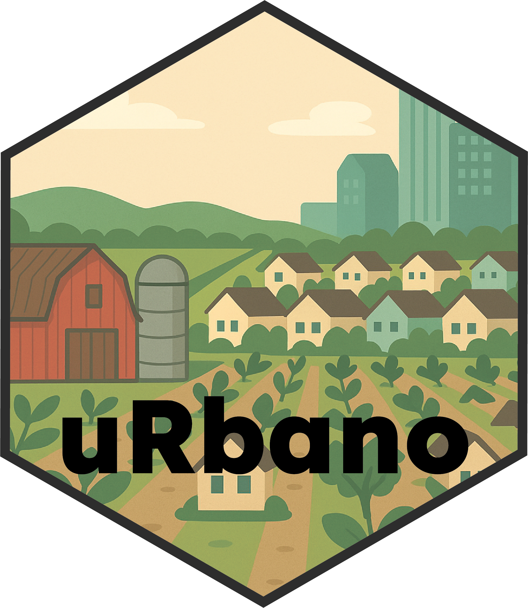

# `uRbano` - functions for spatial sampling across built density gradients
`uRbano` is designed to support spatial sampling design across urban environmental gradients, to guide users in building reproducible, gradient-informed experimental designs for ecological research in urban and human-modified landscapes.


## Installation

coming soon...

``` r
# install.packages("urbano")

```

## Sources

`uRbano` pulls building footprints from several sources depending on the region of interest

`uRbano` uses the `rosm` package to access the OpenStreetMaps Overpass API to import road features for calculating road density metrics
